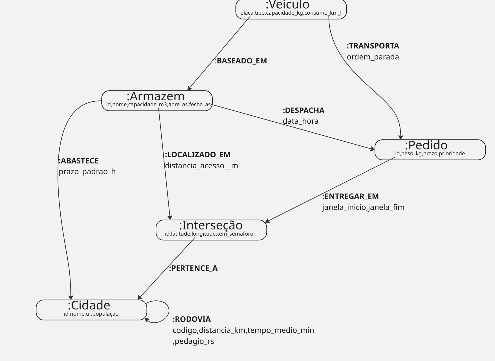
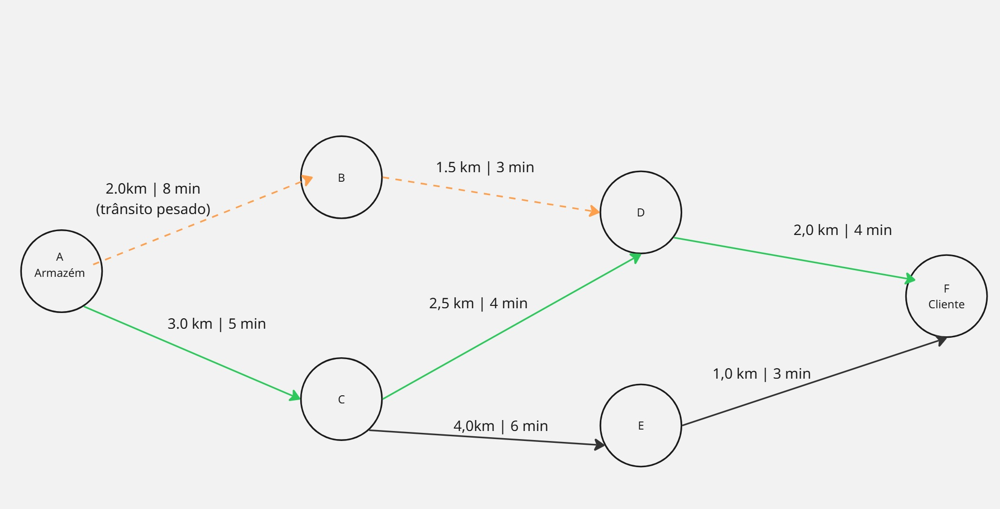

# O_Mundo_em_Grafos_e_o_Paradoxo_Relacional-Grupo 3 Thiago e Lucas


### O Mundo em Grafos e o Paradoxo Relacional
### Grupo 3 — Roteamento e Logística (tipo Waze / Uber)
### Integrantes: Thiago Henrique · Lucas Aoki 
### Disciplina: Banco de Dados NoSql
### Professor(a): Leonardo
Data:05/10/2026  
  
1. O Problema de Negócio  
1.1 Cenário

Imagine uma empresa de entregas e transporte que tem um aplicativo parecido com o Waze (mostra o caminho) e com o Uber (manda um veículo buscar ou entregar algo). Todos os dias, o sistema precisa responder perguntas como:

"Qual é o caminho mais rápido do armazém até a casa do cliente, com o trânsito de agora?"
"Qual é o caminho mais barato (menos quilômetros e menos pedágio) de Maringá até Curitiba?"
"Uma rua foi fechada. Quais entregas precisam mudar de caminho?"

Para isso, o sistema trabalha com cidades, armazéns, cruzamentos, ruas, rodovias, veículos e pedidos. O mais importante aqui não é cada informação sozinha, e sim como elas se ligam. Saber que existe a "Rua X" não ajuda muito. O que importa é: de onde ela sai, para onde ela vai, quanto tempo leva para passar por ela agora e qual rua vem depois.

1.2 Por que é difícil cruzar essas informações
Não sabemos o tamanho do caminho. Uma rota pode passar por 3 ruas ou por 300.
O tempo muda o tempo todo. A distância de uma rua é sempre a mesma, mas o tempo para atravessá-la muda com trânsito, acidentes e obras. Por isso, o caminho mais curto nem sempre é o mais rápido.
A rede é enorme. Uma cidade grande tem milhares de cruzamentos, e um país tem milhões. Mesmo assim, é possível calcular rotas em milésimos de segundo, desde que a malha de ruas seja tratada como um grafo (BAST et al., 2016).
Existe mais de um objetivo. Às vezes queremos o caminho mais rápido, às vezes o mais curto, às vezes o mais barato.

Resumo: o problema é achar o melhor caminho numa rede gigante, onde os custos mudam a todo momento. Esse é um problema clássico de grafos (DIJKSTRA, 1959; CORMEN et al., 2012).

## 2. Questão Relacional

Os bancos de dados mais comuns (MySQL, PostgreSQL, SQL Server) são chamados de relacionais e guardam tudo em tabelas.  

Num banco relacional, a ligação entre duas informações não fica guardada como um caminho pronto. Ela é montada de novo a cada consulta, comparando códigos (IDs) entre tabelas com o comando JOIN.

2.2 Como as ruas ficariam num banco relacional

Seriam duas tabelas: uma de cruzamentos e outra de trechos de rua (um trecho liga um cruzamento a outro).

sql
### -- Tabela com os cruzamentos (pontos do mapa)
```
 CREATE TABLE intersecao (
  id        BIGINT PRIMARY KEY,
  latitude  DECIMAL(9,6),
  longitude DECIMAL(9,6)
);
```

### -- Tabela com os trechos de rua: cada linha liga um cruzamento a outro
```
CREATE TABLE trecho (
  origem_id     BIGINT REFERENCES intersecao(id),  -- de onde sai
  destino_id    BIGINT REFERENCES intersecao(id),  -- para onde vai
  nome_via      VARCHAR(120),                      -- nome da rua
  distancia_m   INT,                               -- tamanho em metros
  tempo_s       INT,                               -- tempo em segundos (muda com o trânsito)
  PRIMARY KEY (origem_id, destino_id)
);
````
A tabela trecho é do tipo N:M (muitos para muitos): cada cruzamento se liga a vários outros. Numa cidade grande, ela teria milhões de linhas.

### 2.1 O problema do Self-Join (a tabela ligada com ela mesma)

Para descobrir um caminho, a tabela trecho precisa ser ligada com ela mesma uma vez para cada rua percorrida. Isso se chama self-join. Veja como fica um caminho de só 3 ruas:

```sql
SELECT t1.origem_id, t1.destino_id AS p1, t2.destino_id AS p2, t3.destino_id AS destino,
       t1.tempo_s + t2.tempo_s + t3.tempo_s AS tempo_total
FROM trecho t1
JOIN trecho t2 ON t2.origem_id = t1.destino_id   -- 2ª rua começa onde a 1ª termina
JOIN trecho t3 ON t3.origem_id = t2.destino_id   -- 3ª rua começa onde a 2ª termina
WHERE t1.origem_id = 101          -- armazém
  AND t3.destino_id = 987         -- cliente
ORDER BY tempo_total
LIMIT 1;
```

Problema 1 :Não sabemos quantos JOINs usar	

Se a rota tiver 30 ruas, a consulta precisa de 30 JOINs. Como não sabemos o tamanho antes, não dá para escrever uma consulta só.


Problema 2: Cada JOIN custa caro	

 A cada rua, o banco precisa procurar na tabela inteira (milhões de linhas) qual é a próxima. Mesmo com índice, isso se repete a cada passo (ELMASRI; NAVATHE, 2018).


Problema 3 Ruas formam voltas

Quarteirões fazem círculos. Sem cuidado, a consulta fica andando em volta do mesmo quarteirão.


Problema 4: O banco testa tudo	

 O SQL monta todos os caminhos possíveis e só depois escolhe o melhor. Ele não descarta antes os caminhos que já ficaram ruins.


### 2.4 A Explosão Combinatória

Explosão combinatória é quando o número de combinações cresce muito rápido conforme o problema aumenta. Se cada cruzamento tiver, em média, 3 opções de saída:

Ruas no caminho	Caminhos possíveis (3 × 3 × 3...)
5	243
10	59.049
20	3.486.784.401 (quase 3,5 bilhões)

Um caminho comum na cidade passa facilmente por 20 cruzamentos. Montar bilhões de combinações para entregar um único caminho é o que deixa o servidor lento.

### 2.5 "Mas o SQL não tem consulta recursiva?"

Tem. O comando WITH RECURSIVE permite repetir o JOIN automaticamente, sem escrever um por um . Só que, por dentro, cada repetição continua sendo um JOIN na tabela inteira, e o banco continua abrindo todos os caminhos ao mesmo tempo, sem priorizar o mais promissor. Funciona para redes pequenas, mas não para o mapa de uma cidade com trânsito mudando a cada minuto.

### 2.6 O que os testes mostram

 Compararam um banco de grafos (Neo4j) com um banco relacional (MySQL). Nas consultas que andam pelas ligações (de um ponto para o próximo), o banco de grafos foi bem mais rápido, chegando a 10 vezes. Os autores também mostraram que, em buscas simples por números, o MySQL foi melhor. A conclusão é: cada banco tem seu ponto forte, e calcular rotas é justamente "andar pelas ligações".

### 2.7 Por que o banco de grafos resolve

Num banco de grafos como o Neo4j/Cypher, cada ponto já guarda o endereço dos seus vizinhos. É como se cada esquina tivesse uma placa apontando para as próximas esquinas. Para andar de uma esquina para a outra, basta seguir a placa, sem procurar no banco inteiro. Isso se chama adjacência livre de índice (index-free adjacency). Assim, o tempo da consulta depende só do pedaço do mapa que foi percorrido, e não do tamanho do banco .

## 3. O Modelo de Grafo  
### 3.1 Antes de tudo: o que é um grafo?  
  
Um grafo é um desenho de pontos ligados por setas:

Nó = uma "coisa" (um cruzamento, uma cidade, um armazém...).
  
Aresta = a ligação entre duas coisas, desenhada como uma seta. Ela tem um nome em forma de verbo em maiúsculas (ex.: DESPACHA, PERTENCE_A).
  
Propriedades = informações guardadas no nó ou na aresta, no formato chave: valor (ex.: nome: "Maringá", tempo_s: 300).

Esse jeito de organizar se chama Modelo de Grafo de Propriedades. É o modelo usado pelo Neo4j e pela linguagem oficial de grafos GQL, que virou norma internacional ISO em 2024.

### 3.2 Diagrama da arquitetura


### NÓ(propriedade):
:Cidade(id,nome,uf,população);  
:Interseção(id,latitude,longitude,tem_Semaforo);   
:Armazem(id,nome,capacidade_m3,abre_as,fechas_as);  
:Veiculo(placa,tipo,capacidade_kg,consumo_km_l);  
:Pedido(id,peso_kg,prazo,prioridade)  


###  Arestas(propriedades) (as ligações, sempre com seta)

:TRECHO(nome_via, distancia_m, vel_max_kmh,vel_atual_kmh, tempo_s, nivel_transito, pedagio_rs, atualizado_em);  
:RODOVIA(codigo (ex.: BR-376), distancia_km, tempo_medio_min, pedagio_rs);  
:PERTENCE_A();  
:LOCALIZADO_EM(distancia_acesso_m);   
:ABASTECE(prazo_padrao_h);  
:DESPACHA(data_hora);   
:ENTREGAR_EM(janela_inicio, janela_fim);   
:TRANSPORTA(ordem_parada);   
:BASEADO_EM()  

### 3.4 Duas "camadas" no mesmo mapa
Camada grande (entre cidades): Cidade → RODOVIA → Cidade. Ex.: Maringá → Londrina → Curitiba.
Camada pequena (dentro da cidade): Intersecao → TRECHO → Intersecao. É o caminho até a porta do cliente.

A ligação :PERTENCE_A junta as duas camadas. .

### 3.5 Exemplo prático (valores inventados para ilustrar)



Saindo do Armazém (A) até o Cliente (F):

O que queremos	Melhor caminho	Resultado  
Menor distância	A → B → D → F	5,5 km, mas leva 15 min  
Menor tempo	A → C → D → F	7,5 km, mas leva só 13 min  

A rua A→B é a mais curta, mas está congestionada. Com o mesmo mapa, o sistema responde perguntas diferentes: basta escolher qual informação da seta vai ser usada como custo (distância ou tempo).

## 4. Como o banco de grafos responde as perguntas

No Neo4j, as consultas são escritas na linguagem Cypher. Ela é fácil de ler porque desenha o caminho com símbolos:

( ) parênteses = um nó → (a:Intersecao) quer dizer "um cruzamento chamado a";  

-[ ]-> colchetes com seta = uma ligação → -[:TRECHO]-> quer dizer "um trecho de rua indo para";  

{ } chaves = propriedades → {id: 'A'}.  

Ou seja, (a)-[:TRECHO]->(c) se lê: "o cruzamento A tem um trecho de rua que vai até o cruzamento C".

### 4.1 Cadastrar uma rua entre dois cruzamentos

```cypher
MATCH (a:Intersecao {id: 'A'}), (c:Intersecao {id: 'C'})  
CREATE (a)-[:TRECHO {nome_via: 'Av. Brasil', distancia_m: 3000,  
                     tempo_s: 300, nivel_transito: 'livre'}]->(c);  
```
 Encontre o cruzamento A e o cruzamento C. Depois, crie uma ligação de A para C: é a Av. Brasil, tem 3 km, leva 5 minutos e o trânsito está livre.

### 4.2 Achar o caminho mais rápido

```cypher  
MATCH (origem:Intersecao {id: 'A'}), (destino:Intersecao {id: 'F'})  
CALL gds.shortestPath.dijkstra.stream('malhaViaria', {  
    sourceNode: origem,  
    targetNode: destino,  
    relationshipWeightProperty: 'tempo_s'  
})  
YIELD totalCost, nodeIds  
RETURN totalCost / 60 AS minutos,  
       [id IN nodeIds | gds.util.asNode(id).id] AS rota;  
```
Pegue o ponto de partida A e o destino F. Use o algoritmo de Dijkstra, que já vem pronto no Neo4j (NEO4J, 2025a), para achar o caminho em que a soma do tempo das ruas seja a menor possível. Mostre o tempo total em minutos e a lista de cruzamentos do caminho.

Resultado no nosso exemplo: 13 minutos, rota A → C → D → F.

Para pedir o caminho mais curto, basta trocar 'tempo_s' por 'distancia_m'.

Como o Dijkstra pensa (sem fórmula): ele começa na partida e vai sempre continuando pelo caminho mais barato encontrado até agora. Quando chega ao destino, aquele é o melhor caminho. Assim, ele não precisa testar os bilhões de combinações da explosão combinatória (DIJKSTRA, 1959).

### 4.3 Achar o caminho usando o GPS como "bússola" (A*)

```cypher  
CALL gds.shortestPath.astar.stream('malhaViaria', {  
    sourceNode: origem, targetNode: destino,  
    latitudeProperty: 'latitude', longitudeProperty: 'longitude',  
    relationshipWeightProperty: 'distancia_m'  
}) YIELD totalCost, nodeIds  
RETURN totalCost, nodeIds;  
```
Faz como o Dijkstra, mas use a latitude e a longitude para saber para que lado fica o destino e dê preferência às ruas nessa direção. O algoritmo A* (lê-se "A estrela") faz menos tentativas porque não perde tempo indo para o lado oposto (HART; NILSSON; RAPHAEL, 1968; NEO4J, 2025b).

### 4.4 Atualizar o trânsito em tempo real

```cypher  
MATCH (:Intersecao {id: 'A'})-[t:TRECHO]->(:Intersecao {id: 'B'})  
SET t.vel_atual_kmh = 15, t.tempo_s = 480,  
    t.nivel_transito = 'pesado', t.atualizado_em = datetime();  
 ```
Encontre a rua que vai de A para B e atualize: velocidade de 15 km/h, 8 minutos para atravessar, trânsito pesado, atualizado agora.Só uma ligação muda, e o resto do banco fica igual. Na próxima busca, o Dijkstra já evita essa rua.

### 4.5 Rua fechada: quais pedidos são afetados?

``` cypher
MATCH (:Armazem)-[:DESPACHA]->(p:Pedido)-[:ENTREGAR_EM]->(:Intersecao)  
WHERE p.id IN $pedidosComRotaPeloTrecho  
RETURN p.id, p.prioridade;  
```
Siga as setas Armazém → Pedido → local de entrega e me mostre os pedidos cuja rota passa pela rua fechada, junto com a prioridade de cada um. Assim, a empresa sabe quais entregas precisam de um novo caminho.

## 5. Conclusão

### Calcular rotas é, na prática, achar o melhor caminho num grafo. No banco relacional, cada rua percorrida vira mais um JOIN da tabela com ela mesma. Como não sabemos quantas ruas a rota terá, e as combinações crescem muito rápido (explosão combinatória), o servidor fica lento.

 No banco de grafos, as ligações já ficam guardadas: cada esquina sabe quais são as próximas. Algoritmos conhecidos, como Dijkstra e A*, já vêm prontos e usam a distância ou o tempo das ruas, que podem ser atualizados na hora sem refazer o banco.

Por isso, defendemos que, num sistema tipo Waze/Uber, a ligação entre as informações (a rua, o sentido e o tempo atual) vale mais do que cada dado sozinho. A mudança para grafos é essencial nessa parte. O banco relacional pode continuar sendo usado no que faz bem (cadastro de clientes, pagamentos e relatórios), formando uma arquitetura híbrida. 


## Referências
AMAZON WEB SERVICES. O que é um banco de dados de grafos? [S. l.]: AWS, 2026. Disponível em: https://aws.amazon.com/pt/nosql/graph/. Acesso em: 5 out. 2026.  

DALTIO, Jaudete. Bancos de dados de grafos. Campinas: Unicamp, 2018. Slides da disciplina MC536 – Bancos de Dados. Disponível em: https://www.ic.unicamp.br/~cmbm/MC536/bdgrafos-jaudete2018.pdf. Acesso em: 5 out. 2026.  

ERICKSON, Jeffrey. O que é um banco de dados de grafos? [S. l.]: Oracle, 9 jan. 2026. Disponível em: https://www.oracle.com/br/autonomous-database/what-is-graph-database/. Acesso em: 5 out. 2026.  

GOOGLE CLOUD. O que é um banco de dados de grafos? [S. l.]: Google, [20--]. Disponível em: https://cloud.google.com/discover/what-is-a-graph-database?hl=pt-BR. Acesso em: 5 out. 2026.  

MICROSOFT. O que é um banco de dados de grafo? Microsoft Learn. [S. l.]: Microsoft, 20 maio 2026. Disponível em: https://learn.microsoft.com/pt-br/fabric/graph/graph-database. Acesso em: 5 out. 2026.  

NEO4J. Dijkstra source-target shortest path. Neo4j Graph Data Science Documentation. [S. l.]: Neo4j, [2026]. Disponível em: https://neo4j.com/docs/graph-data-science/current/algorithms/dijkstra-source-target/. Acesso em: 5 out. 2026.  

SAP. O que é um banco de dados de grafos? [S. l.]: SAP, [20--]. Disponível em: https://www.sap.com/brazil/resources/graph-database. Acesso em: 5 out. 2026.  
  